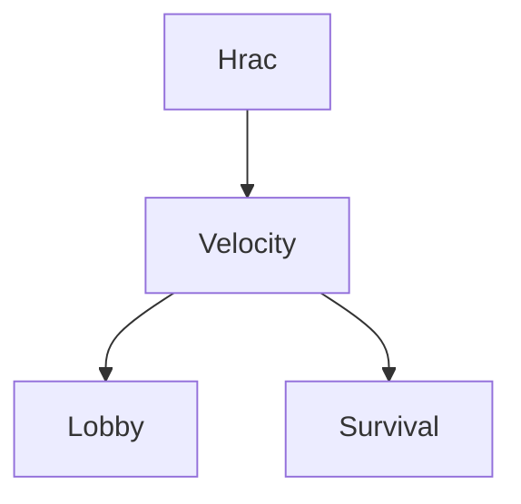

import {CardGrid, LinkCard, Steps, TabItem, Tabs, FileTree} from '@astrojs/starlight/components';

Proxy server je speciální typ serveru, který slouží jako "brána". Umožňuje propojit více Minecraft serverů (Lobby, Survival, Skyblock) do jedné sítě, takže se hráči mohou mezi nimi přepínat příkazem `/server` nebo přes portály, aniž by se museli odpojovat.



## Výběr Proxy softwaru

Doba pokročila a staré řešení už nestačí. Zde je přehled dostupných možností.

<CardGrid>
    <LinkCard title="Velocity"
              description="Moderní, bezpečná a extrémně výkonná proxy. Jediná správná volba pro dnešní servery."
              href="https://papermc.io/downloads/velocity" target="_blank" icon="rocket"/>
    <LinkCard title="BungeeCord"
              description="Zastaralá legenda. Méně bezpečná a náročnější na výkon. Používej pouze pokud musíš."
              href="https://ci.md-5.net/job/BungeeCord/lastSuccessfulBuild/" target="_blank" icon="warning"/>
</CardGrid>

:::danger[Nepoužívej mrtvé projekty]
Projekt **Waterfall** je oficiálně ukončený (End of Life) a nedostává žádné aktualizace. Nepoužívej ho, neobsahuje bezpečnostní záplaty. Pokud hledáš náhradu za Waterfall, přejdi na **Velocity**.
:::

## Hardwarové požadavky

Proxy servery pouze přeposílají pakety, nepočítají fyziku světa ani AI monster. Proto jsou velmi nenáročné.
* **RAM:** Pro většinu sítí (do 500 hráčů) bohatě stačí **512 MB - 1 GB RAM**.
* **CPU:** Minimální zátěž.
* **Port:** Doporučujeme, aby proxy běžela na portu **25565** (výchozí MC port).

---

## Instalace a Nastavení

Vyber si software, který chceš použít.

<Tabs>
    <TabItem label="🚀 Velocity (Doporučeno)">
        Velocity má přímou podporu pro Paper, Sponge, Fabric i Forge (1.7.2 - 1.21+). Používá **Modern Forwarding**, což
        je bezpečnější a rychlejší než starý Bungee protokol.

        <Steps>

            1. **Stažení a Příprava**

                Stáhni nejnovější [Velocity](https://papermc.io/downloads/velocity). Ujisti se, že máš nainstalovanou **Javu
                21**.
                Nahraj soubor `velocity.jar` na server a spusť ho.

            2. **Nastavení Proxy (velocity.toml)**

                Po prvním startu se vytvoří soubor `velocity.toml`. Otevři ho a uprav:

                <FileTree>
                - **velocity.toml**
                </FileTree>

                ```toml
                [servers]
                # Nastavení tvých serverů (Název = "IP:PORT")
                lobby = "127.0.0.1:30001"
                survival = "127.0.0.1:30002"

                # Server, na který se hráč připojí jako první
                try = ["lobby"]

                # Pořadí serverů pro tab-list (volitelné)
                forced-hosts = {}

                [advanced]
                # DŮLEŽITÉ: Povolení moderního forwardingu
                # Zajišťuje bezpečné předání skinů a UUID
                player-info-forwarding-mode = "modern"
                forwarding-secret-file = "forwarding.secret"
                ```

                *Soubor `forwarding.secret` se vygeneruje automaticky. Jeho obsah budeš potřebovat.*

                <FileTree>
                - **forwarding.secret**
                </FileTree>

            3. **Nastavení Backend serverů (Paper)**

                Na každém herním serveru (Lobby, Survival...) musíš upravit konfiguraci.

                **A. server.properties**

                <FileTree>
                - **server.properties**
                </FileTree>

                ```properties
                online-mode=false
                ```

                **B. config/paper-global.yml**
                Najdi sekci `proxies` a nastav ji pro Velocity:

                <FileTree>
                - config/
                  - **paper-global.yml**
                </FileTree>

                ```yaml
                proxies:
                velocity:
                enabled: true
                online-mode: true # Případně false, pokud máš server i pro warez hráče
                secret: "zde-vloz-obsah-souboru-forwarding-secret-z-proxy"
                ```
                *Pozor: V `spigot.yml` musí být `bungeecord: false`!*

            4. **Restart**

                Restartuj proxy i všechny herní servery.

        </Steps>

        **Startovací příkaz pro Velocity:**
        ```bash
        java -Xms1G -Xmx1G -XX:+UseG1GC -XX:G1HeapRegionSize=4M -XX:+UnlockExperimentalVMOptions
        -XX:+ParallelRefProcEnabled -XX:MaxInlineLevel=15 -jar velocity.jar

        ```

    </TabItem>

    <TabItem label="🌊 BungeeCord (Legacy)">
        Pokud z nějakého důvodu nemůžeš použít Velocity.

        <Steps>

            1. **Instalace**
                Stáhni [BungeeCord](https://ci.md-5.net/job/BungeeCord/) a spusť ho (vyžaduje Javu podle verze MC, pro 1.21
                je to Java 21).
            2. **Nastavení Proxy (config.yml)**
                Otevři `config.yml` a nastav:

                <FileTree>
                - **config.yml**
                </FileTree>

                ```yaml
                # Povolení předávání UUID a IP adres
                ip_forward: true

                servers:
                lobby:
                motd: '&1Lobby Server'
                address: 127.0.0.1:30001
                restricted: false
                survival:
                motd: '&1Survival Server'
                address: 127.0.0.1:30002
                restricted: false

                priorities:
                - lobby

                ```


            3. **Nastavení Backend serverů**
                Na každém herním serveru uprav:
                **A. server.properties**

                <FileTree>
                - **server.properties**
                </FileTree>

                ```properties
                online-mode=false

                ```


                **B. spigot.yml**

                <FileTree>
                - **spigot.yml**
                </FileTree>

                ```yaml
                settings:
                bungeecord: true

                ```


            4. **Zabezpečení (BungeeGuard)**
                Samotný BungeeCord je **nebezpečný**, protože kdokoli, kdo zná port tvého Survival serveru, se na něj může
                připojit přímo a obejít přihlášení.
                * Nainstaluj plugin **[BungeeGuard](https://www.spigotmc.org/resources/bungeeguard.79601/)** na Proxy i na
                všechny herní servery.
                * Nastav token v `config.yml` (BungeeGuard) tak, aby byl shodný na proxy i serverech.


        </Steps>
    </TabItem>
</Tabs>

## Firewall (Maximální bezpečnost)

I když nastavíš `forwarding secret` nebo BungeeGuard, nejlepší ochranou je **Firewall**.
Pokud máš servery na VPS/Dedikovaném serveru, nastav Firewall tak, aby herní servery (porty 30001, 30002...) přijímaly spojení **pouze z lokální adresy** (127.0.0.1).

Tím zajistíš, že jediná cesta dovnitř vede přes Proxy (port 25565).

:::caution[Pozor na porty]
Při nastavování firewallu (UFW/IPTables) si omylem nezablokuj SSH (port 22) nebo port Proxy (25565)!
:::